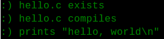
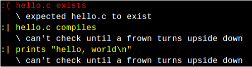

# IT VBE + CS50

 Labas! Aš esu <a href="https://www.linkedin.com/in/arnaspuidokas">Arnas</a>👋
 

 Žemiau rasite pamoką apie tai, kaip galite pritaikyti GitHub, CS50 į IT egzamino pasiruošimą. 💻 

* <a href="https://nec.lt/failai/7417_IT-VBE-1_2018-GALUTINE.pdf" target="_blank">Pamokoje naudojama IT egzamino užduotis 🖥️</a>

*  [CS50 kurso informacija](https://www.edx.org/course/cs50s-introduction-to-computer-science) 🎓

* [Check50 dokumentacija](https://cs50.readthedocs.io/) ☑️

* [CS50 laboratorija](https://cs50.readthedocs.io/lab/) 🧪

*  [Turing School](http://tschool.io) 📓

* [Mano sukurta video pamoka](youtube.com) 📹

# Pamokos tvarkarašis 

1. [Check50 dokumentacija](https://github.com/arnasp13/IT_vbe/tree/master/Slidininkai#check50-dokumentacija)
   
   1. [Check50](https://github.com/arnasp13/IT_vbe/tree/master/Slidininkai#kas-yra-check50)
   2. [Komandos](https://github.com/arnasp13/IT_vbe/tree/master/Slidininkai#komandos)
   
2. [IT valstybinis brandos egzaminas](https://github.com/arnasp13/IT_vbe/tree/master/Slidininkai#it-valstybinis-brandos-egzaminas)
   
   1. [Egzamino struktūra ir vertinimas.](https://github.com/arnasp13/IT_vbe/tree/master/Slidininkai#egzamino-strukt%C5%ABra-ir-vertinimas)
   2. [Kaip pasiruošti pirmąjai daliai?](https://github.com/arnasp13/IT_vbe/tree/master/Slidininkai#kaip-pasiruo%C5%A1ti-pirm%C4%85jai-daliai)
   3. [Kaip pasiruošti antrąjai daliai?](https://github.com/arnasp13/IT_vbe/tree/master/Slidininkai#kaip-pasiruo%C5%A1ti-antr%C4%85jai-daliai)
   4. [Kaip pasiruošti trečiąjai daliai?]()
   5. [Kaip pasiruošti ketvirtąjai daliai?]()

3. [Užduoties sukūrimas.](https://github.com/arnasp13/IT_vbe/tree/master/Slidininkai#u%C5%BEduoties-suk%C5%ABrimas)
   
   1. [C++ failas](https://github.com/arnasp13/IT_vbe/tree/master/Slidininkai#sukurkite-c-fail%C4%85)
   2. [.cs50.yaml failas](https://github.com/arnasp13/IT_vbe/tree/master/Slidininkai#sukurkite-cs50yaml-fail%C4%85)
   3. [Duomenų failai]()

4. [Kaip galiu prisidėti prie projekto?](https://github.com/arnasp13/IT_vbe/tree/master/Slidininkai#kaip-galiu-prisid%C4%97ti-prie-projekto)

5. [Markdown](https://en.wikipedia.org/wiki/Markdown)
   
   1. Kas yra *Markdown*?
   2. Kaip naudoti *Markdown*? 

# Check50 dokumentacija

### Kas yra *check50*? 

`check50` yra komandų aplinka įdiegta, kuria naudodamiesi galite patikrinti programos teisingumą.

Moksleivis pateikęs tokią komandą (pavyzdys) gaus rezultatus.

      check50 arnaspdk/ITvbe/programavimas/slidininkai

`submit50` yra CS50 įrankis skirtas problemų sprendimų pateikimui. 

### Programos ID

Kiekviena `check50` tikrinama programa turi savo unikalų ID, kuri identifikuoja programą. 

### Teisingo ir neteisingo atsakymų pateikimai

Kiekvienos programos teisingumas gali būti parodytas atsakymą, kuri galima modifikuoti. Pavyzdys 👇, taip gali atrodyti teisingo atsakymo vaizdavimas.

Neteisingo:

### Komandos

      check50

[*check50*](https://cs50.readthedocs.io/projects/check50/en/latest/) yra įrankis, kuriuo besimokantis gali patikrinti savo kodą.

      style50

[*style50*](https://github.com/cs50/style50) yra įrankis, kuriuo naudodamiesi galite patikrinti kodo stilių.

# IT valstybinis brandos egzaminas

### Egzamino struktūra ir vertinimas

| Veiklos sritys                                          | Procentai |
|---------------------------------------------------------|-----------|
| Saugus ir teisėtas informacijos ir interneto naudojimas | 10        |
| Tekstinių dokumentų maketavimas                         | 20        |
| Skaitinės informacijos apdorojimas skaičiuokle          | 20        |
| Programavimas                                           | 50        |

[Daugiau informacijos](https://www.egzaminai.lt/failai/5817_IT_BE_programa_patvirtinta_2016_m_sausio_7_d..pdf)

### Egzaminui reikalinga informacija ir programos

1. [CodeBlocks](http://www.codeblocks.org/) programavimo aplinka, kuri bus naudojama egzamine.
2. [MS Office]()

- - -
  
### Kaip pasiruošti pirmąjai daliai?

Turite žinoti šiuos dalykus:

1. Rūpintis informacijos saugumu.
   1. Nusakyti informacijos saugumo kompiuteryje problemas.
   2. Apibrėžti kompiuterio kenkėjiškų ir sukčiavimo programų sąvokas, jų žalos padarinius.
   3. Apibūdinti informacijos apsaugos kompiuteryje priemones, paaiškinti, kaip jomis naudotis.
2. Laikytis asmens duomenų ir autorių teisių apsaugos įstatymų.
   1. Nusakyti asmens duomenų saugumo problemas.
   2. Žinoti, kur galima rasti svarbiausius šalies asmens duomenų ir autorių teisių apsaugos įstatymus.
   3. Apibūdinti asmens duomenų teisėtą naudojimą.
   4. Apibūdinti programinės įrangos licencijavimą, autorių teises.
3.  Laikytis saugaus bendravimo ir veikimo socialiniuose tinkluose nuostatų
    1.  Apibrėžti tinklaraščio, socialinio tinklo, vikio sąvokas ir nusakyti jų paskirtį.
    2.  Paaiškinti, kaip saugiai uţsiregistruoti ir prisijungti prie tinklaraščio paslaugas teikiančios interneto svetainės.
    3.  Paaiškinti, kaip saugiai uţsiregistruoti ir prisijungti prie socialinio tinklo.
    4.  Paaiškinti, kaip saugiai ir teisėtai teikti įvairią informaciją viešojoje erdvėje.
    5.  Paaiškinti, kaip saugiai ir korektiškai bendrauti ir bendradarbiauti viešojoje erdvėje.
4. Apibūdinti elektroninį parašą ir jo paskirtį.
   1. Apibrėžti elektroninio parašo sąvoką ir nusakyti jo teisinę galią ir paskirtį.
   2. Pateikti elektroninio parašo naudojimo pavyzdžių.
5. Naudotis elektroninėmis paslaugomis.
   1. Pateikti elektroninės valdžios, elektroninio verslo ir kitų šiuolaikinių elektroninių paslaugų pavyzdžių.
   2. Paaiškinti, kaip naudotis pasirinktomis elektroninėmis paslaugomis.

* * *
  
### Kaip pasiruošti antrąjai daliai?

1. Sudaryti kelių lygių ţenklintus ir / ar numeruotus sąrašus, juos tvarkyti.
   1. Žinoti ženklinto ir numeruoto sąrašų paskirtį.
   2. Dokumente sudaryti kelių lygių numeruotą ar / ženklintą sąrašą.
   3. Tvarkyti (šalinti) kelių lygių sąrašų formatus: numeravimo (ženklinimo) stilių, numerio (simbolio) lygiuotę, teksto eilučių įtrauką.
2. Naudotis teksto tabuliavimo žymėmis.
   1. Žinoti teksto tabuliavimo žymės sąvoką ir jos paskirtį.
   2. Naudoti skirtingas tabuliavimo žymes.

# Užduoties sukūrimas

### Sukurkite *C++* failą. 

Pirmiausia aprašome bibliotekas:

      #include <fstream>
      #include <iomanip>
      #include <iostream>
  
Bibliotekų paaiškinimai:
   1. [fstream](http://www.cplusplus.com/reference/fstream/fstream/)
   2. [iomanip](http://www.cplusplus.com/reference/iomanip/?kw=iomanip)
   3. [iostream](http://www.cplusplus.com/reference/istream/iostream/?kw=iostream)

   Aprašome kodo pradžią:

      int main()
      {  
      return 0;
      }

* * *         

### Sukurkite *.cs50.yaml* failą.          

Šio failo paskirtis yra dirbti su CS50 [labaratorija](https://cs50.readthedocs.io/lab/).

Deklaruokime tai, kas bus reikalinga LAB50 aplinkoje:

      lab50:
         files:
            - !exclude "*"
            - !include "FAILO_PAVADINIMAS.cpp"
            - !include "DUOMENŲ_ĮVEDIMO_FAILAS.txt"
            - !include "DUOMENŲ_IŠVEDIMO_FAILAS.txt"
      
Pridėkime tai, kas bus reikalinga Check50 sistemai:

      check50:
         files:
            - !exclude "*"
            - !require "FAILO_PAVADINIMAS.cpp"
            - !require "DUOMENŲ_ĮVEDIMO_FAILAS.txt"
            - !require "DUOMENŲ_IŠVEDIMO_FAILAS.txt"

* * *

### Sukurkime duomenų įvedimo ir išvedimo failus.

  1. Sukurti reikia paspaudus *Create new file* jūsų projekto aplinkoje.
  2. Įveskite duomenų failo pavadinimą *Name your file...* laukelyje.

         DUOMENŲ_ĮVEDIMO_FAILAS.txt
   3. Paspauskite apačioje žalią mygtuką *Commit new file*.

Visiškai taip pat, kaip duomenų įvedimo failą, taip sukurkite ir išvedimo failą.
   
         DUOMENŲ_IŠVEDIMO_FAILAS.txt

* * *

### Sukurkite Python failą.

Failą pavadinkite: 

      __init__.py

Šį failą turite sukurti naudodami [Python](https://www.python.org/) programavimo kalbą.

* * * 

<h3> VALIO! Gera pradžia ✨ </h3> 

Dabar pradėkime kurti unikalią programą skirta uždavinio sprendimui palengvinti, kuri:
1. Patikrins ar yra visi reikalingi failai.
2. Pažiūrės ar duomenų failai aprašyti teisingai.
3. Užtrikrins, kad rezultatų faile yra išvesta teisinga informacija.

* * *
### SVARBI INFORMACIJA

- Tarpai ir formatavimas yra labai svarbu, todėl atkreipkite dėmesį į tai.
- Šioje GitHub repozitorijoje galite rasti pavyzdinius failus.
- Python failas yra aprašytas žingsnis pagal žingsnį, todėl viską lengvai rasite :)

- - - 
  
### Žingsnis #1

Pirmiausia, importuokime *check50* aplinką.

      import check50

Vykdykime *check* funkciją naudodami *check50* ir deklaruokime funkciją.

      @check50.check()
      def pradiniaiFailai():
      

Jeigu nebus klaidų, išveskime tokį tekstą (kompiliatoriuje matysite tokią žinutę be kabučių, galite modifikuoti):

            """C++ failas yra sėkmingai sukurtas."""
            check50.exists("FAILO_PAVADINIMAS.cpp")

* * *

### Žingsnis #2

 Keliaukime toliau! 🤓 

Turėkite omeny, jog tai yra kita funkcija! `@check50.check(pradiniaiFailai)` atitinka *F9* CodeBlocks programoje.

      @check50.check(pradiniaiFailai)
      def kompiliavimas():

Toliau vėl išveskime žinutę, kurioje aprašysime atsakymą 👌

            """FAILO_PAVADINIMAS.cpp buvo sukompiliuotas sėkmingai!"""
            check50.run("g++     FAILO_PAVADINIMAS.cpp  -lcrypt -lcs50 -lm -o FAILO_PAVADINIMAS").exit(0) 

* * *

### Žingsnis #3

Jeigu iki šiol viskas buvo padaryta sėkmingai, tada patikrinkime ar yra sukurtas duomenų įvedimo failas.

      @check50.check(pradiniaiFailai)
      def duomenuIvedimas():
         """Duomenų įvedimo failas paruoštas sėkmingai!"""
         check50.exists("DUOMENŲ_ĮVEDIMO_FAILAS.txt")

Na, dabar patikrinkime ar išvedimo failas irgi aprašytas gerai. ✔️

      @check50.check(pradiniaiFailai)
      def duomenuIsvedimas():
         """Duomenų išvedimo failas paruoštas sėkmingai!"""
         check50.exists("DUOMENŲ_IŠVEDIMO_FAILAS.txt")

* * *

### Žingsnis #4

DĖMESIO  ⚠️ 

Nuo dabar turite atkreipti dėmesį į savo užduoties reikalavimus ir pagal juos pritaikyti programą.

Pirma, aprašykime sėkmingo scenarijaus atsakymą.

      @check50.check(pradiniaiFailai)
      def test0():
         """Duomenų įvedimo failo informacija surašyta teisingai."""

Pagal eilučių kiekį patikrinkime ar teisingai įvesti duomenys. Nustatome kiek eilučių dabar turi failas:

         ivestosEilutes = len(open(DUOMENŲ_ĮVEDIMO_FAILAS.txt).readlines())
         

⚡

Įveskite unikalų eilučių skaičių (kiek yra pateikta užduotyje):

         pateiktosEilutes = 13

Tikriname ar faile išvis yra įvestų duomenų:

         if not ivestosEilutes:
            raise check50.Failure("Duomenų įvedime yra klaida. Patikrinkite DUOMENŲ_ĮVEDIMO_FAILAS.txt")

Tikriname ar moksleivio pateiktas eilučių kiekis sutampa su egzamino užduoties pateiktu eilučių kiekiu:

         if ivestosEilutes != pateiktosEilutes:
            raise check50.Failure("Duomenų įvedime yra klaida. Patikrinkite DUOMENŲ_ĮVEDIMO_FAILAS.txt")

* * *

### Žingsnis #5

Taip pat patikrinkime ar išvedimo failas yra naudojamas teisingai. 🧐

      @check50.check(pradiniaiFailai)
      def test1():
         """Duomenų išvedimo failo informacija surašyta teisingai."""
         check50.run("./slidininkai")

Pagal eilučių kiekį patikrinkime ar teisingai įvesti duomenys. Nustatome kiek eilučių turi failas:

      ivestosEilutes = len(open(DUOMENŲ_IŠVEDIMO_FAILAS.txt).readlines())

Įveskite unikalų eilučių skaičių (kiek yra pateikta užduotyje):

      pateiktosEilutes = 5

Tikriname ar faile išvis yra įvestų duomenų:

      if not ivestosEilutes:
         raise check50.Failure("Duomenų įvedime yra klaida. Patikrinkite DUOMENŲ_IŠVEDIMO_FAILAS.txt")

Tikriname ar moksleivio pateiktas eilučių kiekis sutampa su egzamino užduoties pateiktu eilučių kiekiu:

      if ivestosEilutes != pateiktosEilutes:
         raise check50.Failure("Duomenų išvedime yra klaida. Patikrinkite DUOMENŲ_IŠVEDIMO_FAILAS.txt")

* * *

### Žingsnis #6

Patikrinkime ar išvestas atsakymas yra teisingas (sutampa su rezultatais). 💯

Aprašykime sėkmingo scenarijaus rezultatą, ištrinkime duomenų įvedimo failą ir atidarykime rezultatų failą.

      @check50.check(pradiniaiFailai)
      def pvz1:
         """Pateiktas pirmo pavyzdžio atsakymas yra pateiktas teisingai. Sveikinimai!"""
         check50.run("> DUOMENŲ_ĮVEDIMO_FAILAS.txt")
         duomenys = open(DUOMENŲ_ĮVEDIMO_FAILAS.txt, "w")

Aprašykime sėkmingų įvestų pirminių duomenų informaciją (kaip pateikta užduotyje):

      Duom = ["6 \n", "Petras A. Petraitis 15 20 00 \n", "Jurgis Jurgutis 16 12 12 \n", "Rimas Jonas 15 15 59 \n", "Zigmas Nosis 16 23 9 \n", "Romas Senasis 15 15 15 \n", "Rytis Uosis Ainis 16 23 9 \n", "5 \n", "Zigmas Nosis 16 43 15 \n" , "Petras A. Petraitis 15 50 10 \n", "Romas Senasis 16 5 35 \n", "Rytis Uosis Ainis 16 55 59 \n", "Jurgis Jurgutis 16 42 22 \n"]
      
Įrašome į duomenų failą:

      duomenys.writelines(Duom)
      duomenys.close()

Paleidžiame programą:
      
      check50.run("./slidininkai")

Atidarome rezultatų failą ir įrašome į masyvą *rez*:

      with open("Rezultatai.txt") as m:
         rez = m.read().split()

Aprašykime sėkmingų galutinių duomenų informaciją (kaip pateikta užduotyje):

      ats = ["Zigmas", "Nosis", "20", "6", "Jurgis", "Jurgutis", "30", "10", "Petras", "A.", "Petraitis", "30", "10", "Rytis", "Uosis", "Ainis", "32", "50", "Romas", "Senasis", "50", "20"]

Tikriname ar teisingi rezultatai.

      if ats = rez:
         pass
      else:
         raise check50.Mismatch(ats, rez)

* * *

# Markdown

### Kas yra *Markdown*?

Markdown failai yra tekstiniai tekstiniai failai, kuriuose gali būti teksto teksto simboliai (pvz., Pavadinimai, paryškinti, lentelės). MD failus dažnai naudoja ir versijų valdymo sistemos, pvz., „GitHub“ (pvz., „README.md“).

### Kaip aprašyti užduotį?

Sukurkite `README.md` failą. Naudodami [Markdown](https://www.markdownguide.org/cheat-sheet/) galite aprašyti užduotį.  

### Kaip naudoti *Markdown*?

1. Susikurti *Markdown* failą naudojant teksto redagavimo aplinką (pvz.: Notepad) arba tam skirtą Markdown programą (pvz.: Markable).
2. Atidarykite *Markdown* failą.
3. Rašykite Markdown kodą arba konvertuokite HTML kodą / PDF failą į Markdown failą.
      
   1. [HTML į Markdown](https://www.browserling.com/tools/html-to-markdown)
   2. [PDF į Markdown](https://pdf2md.morethan.io/)  

* * *

### Markdown kodas

[Daugiau informacijos](https://www.markdownguide.org/cheat-sheet/)

Pavadinimai 

      # H1
      ## H2
      ### H3
Bold/Italic
      
      ** bold text **
      * italic *
Blockquote

      > blockquote

Numeruotas sąrašas

      1. Pirmas
      2. Antras
      3. Trečias

Nenumuoruotas sąrašas

      - Pirmas
      - Antras
      - Trečias

Kodas

      `Kodas`

Horizantali linija

      - - - 

Nuoroda

      [Pavadinimas](Nuoroda)

Nuotrauka

      

* * *

# Galimybės

Idėjų pritaikymas gali būti įvairus, bet manau, kad galima tikrai naudoti IT pamokose mokykloje, universitetuose, taip palengvinant moksleivių mokimasį ir padarant jį įdomesnį.

Daugiau informacijos:
   - [CS50’s New Submission Tools for Teachers and Students](CS50’s New Submission Tools for Teachers and Students)
   
# Kaip galiu prisidėti prie projekto?

Šis projektas yra [Open-Source](https://lt.wikipedia.org/wiki/Atvirojo_kodo_programa), todėl tikrai galite prisidėti, pvz.: IT problemų sprendimais.

# Kontaktai

Arnas Puidokas:
- [Facebook](https://www.facebook.com/arnas.puidokas10)
- [Instagram](https://instagram.com/arnaspdk)
- [Linkedin](https://www.linkedin.com/in/arnaspuidokas/)
- [Medium](https://medium.com/@arnaspuidokas)
- [Twitter](https://twitter.com/arnaspdk)
